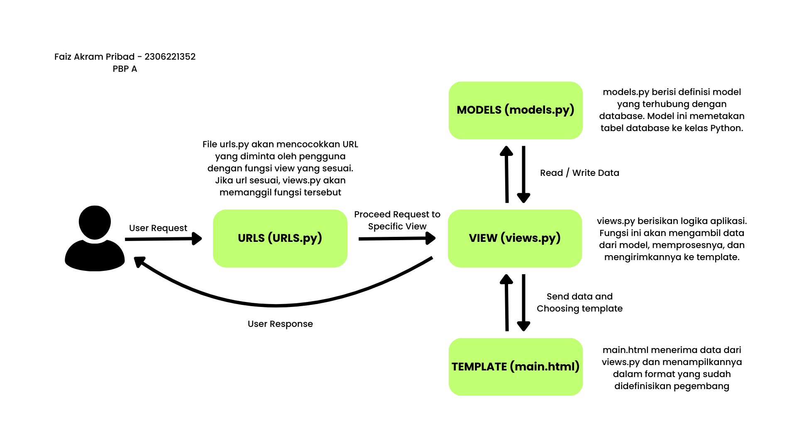
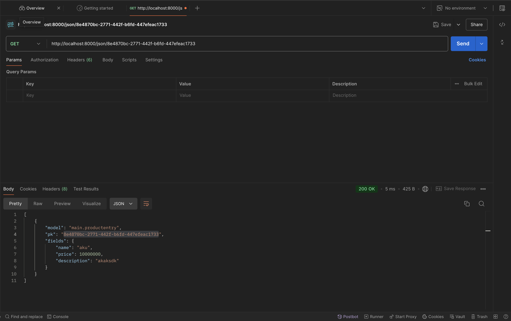
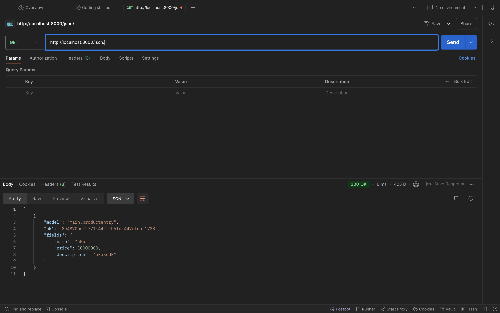
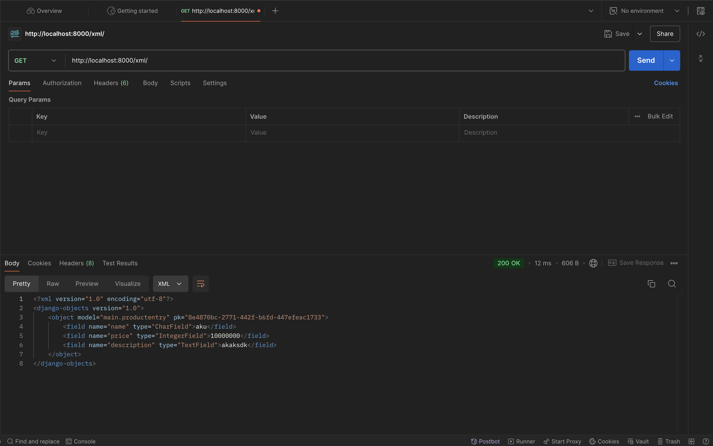
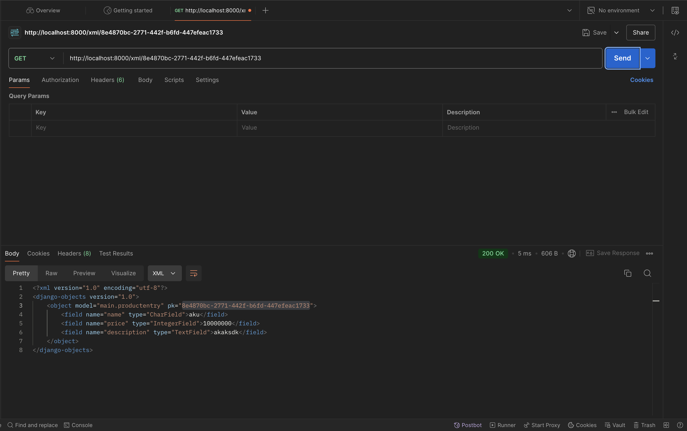

### TUGAS 2

* Jelaskan bagaimana cara kamu mengimplementasikan checklist di atas secara step-by-step (bukan hanya sekadar mengikuti tutorial).
> 1. Membuat Proyek Django:
>Membuat proyek baru dengan menjalankan ``` django-admin startproject tokosuper ```
> 2. Membuat Aplikasi Django:
> membuat aplikasi baru dengan nama main dengan menjalankan ``` python manage.py startapp main ``` , dan menambahkan aplikasi main ke INSTALLED_APPS di settings.py dan mengatur routing untuk mengarahkan aplikasi main pada tokosuper/urls.py. 
> 3. Membuat Model: mendefinisikan model di models.py yang ada didalam aplikasi main, class ProductEntry dengan atribut name, description, price.
> 4. Melakukan migrasi: melakukan migrasi untuk melacak migrasi basis data dengan menjalankan 
```
python manage.py makemigrations
python manage.py migrate
```
> 5. Mendifinisikan views.py dalam aplikasi main:
```
def show_main(request):
    products = {
        'produk' : 'Gulfstream G650ER',
        'harga': 'Rp.15.000.000.000',
        'deskripsi': 'Pesawat terbang'
    }

    context = {
        'products': products,
        'app_name': 'TokoSuper',
        'name': 'Faiz Akram Pribadi',
        'npm': '2306221353',
        'class': 'PBP A',
        'image' : 'https://i0.wp.com/sellallyourstuff.com/wp-content/uploads/2015/10/StickmanWhatToSell.jpg?fit=600%2C298'
    }

    return render(request, "main.html", context)
```
> 6. Membuat file html bernama main.html yang akan merender data yang akan ditampilkan 
> 7. Mengatur routing pada urls.py dalam directory main.
> 8. Melakukan deployment kepada PWS

* Buatlah bagan yang berisi request client ke web aplikasi berbasis Django beserta responnya dan jelaskan pada bagan tersebut kaitan antara urls.py, views.py, models.py, dan berkas html.


* Jelaskan fungsi git dalam pengembangan perangkat lunak!
> Git merupakan sistem kontrol yang digunakan untuk melacak perubahan versi pada pengembangan perangkat lunak, memungkinkan untuk berkolaborasi dengan banyak pengembang pada proyek, memungkinkan adanya pengembangan fitur tanpa perlu mengganggu kode utama, dan menyiapkan cadangan kode sumber yang aman. Pada mata kuliah PBP, Git akan membantu dalam pengembangan proyek tugas kelompok, yang membantu siswa berkolaborasi dalam mengembangkan aplikasi.
* Menurut Anda, dari semua framework yang ada, mengapa framework Django dijadikan permulaan pembelajaran pengembangan perangkat lunak?
> Django dipilih sebagai framework pembelajaran karena didalamnya telah disediakan berbagai fitur bawaan untuk pengembangan perangkat lunak, memiliki kemampuan ORM, dan scalability yang baik. Selain itu, yang utama adalah pendekatan dari konsep MVT.(Model-View-Template).
* Mengapa model pada Django disebut sebagai ORM?
> Django disebut dengan ORM karena Django melakukan penyederhanaan pada interaksi kode python dan database, ORM memungkinkan pengembang untuk menulis query SQL dalam bahasa python.


### TUGAS 3

* Jelaskan mengapa kita memerlukan data delivery dalam pengimplementasian sebuah platform?
> Data delivery diperlukan untuk mengirimkan data antara server dan client. Hal ini memungkinkan data ditampilkan secara dinamis dan interaktif kepada pengguna. Aplikasi hanya akan menampilkan konten statis yang tidak dapat diperbarui atau diubah berdasarkan input dari pengguna.
* Menurutmu, mana yang lebih baik antara XML dan JSON? Mengapa JSON lebih populer dibandingkan XML?
> 1. JSON lebih baik dibandingkan XML dalam banyak kasus karena lebih mudah dibaca oleh manusia. 
> 2. JSON menggunakan sintaks yang lebih sederhana dan lebih mudah diparse oleh mesin.
> 3. JSON lebih efisien dalam ukuran data dan kecepatan parsing.
> 
> Sehingga JSON jauh lebih populer dibandingkan XML dalam pengembangan aplikasi web dan API.
* Jelaskan fungsi dari method is_valid() pada form Django dan mengapa kita membutuhkan method tersebut?
> Method  is_valid() pada form Django digunakan untuk memeriksa apakah data yang dimasukkan sudah sesuai dengan validasi yang telah ditentukan. Method ini akan memastikan bahwa data yang diterima dari pengguna adalah valid sebelum disimpan ke database.
* Mengapa kita membutuhkan csrf_token saat membuat form di Django? Apa yang dapat terjadi jika kita tidak menambahkan csrf_token pada form Django? Bagaimana hal tersebut dapat dimanfaatkan oleh penyerang?
> csrf_token digunakan untuk melindungi aplikasi dari serangan CSRF (Cross-Site Request Forgery). Tanpa csrf_token pada form Django, penyerang dapat membuat permintaan palsu dari situs lain yang akan dijalankan oleh pengguna yang telah login. Hal ini dapat menyebabkan tindakan yang tidak diinginkan seperti perubahan data atau penghapusan data tanpa sepengetahuan pengguna. csrf_token akan meminta token yang valid pada setiap permintaan POST.
* Jelaskan bagaimana cara kamu mengimplementasikan checklist di atas secara step-by-step (bukan hanya sekadar mengikuti tutorial).
> * Mempersiapkan skeleton untuk kerangka dari views dan menambahkan directory dari skeleton pada settings.py
> * Merubah html utama yaitu main.html dengan menyambungkan template skeleton.
> * Meng-import UUID pada models.py dan menambahkannya pada ProductEntry. Setelah itu, melakukn migrations karena ada perubahan pada models.
> * Membuat file forms.py, didalamnya terdapat model untuk menerima entry product.
> * Pada views.py tambahkan forms.py dengan membuat fungsi yang akan memanggil forms.py dan menambahkan datanya pada database.
> * Membuat file html baru untuk menampilkan forms.py, serta mengubah main.html untuk bisa menampilkan data yang didapat dari form.
> * Membuat fungsi show_json, show_json_by_id, show_xml, show_xml_by_id untuk bisa mengembalikan data dalam bentuk xml dan json.
> * Melakukan git add, commit, dan push, untuk memperbarui data pada repository github dan pws.

JSON dan XML di Postman






### TUGAS 4

1. Apa perbedaan antara `HttpResponseRedirect()` dan `redirect()`

   `HttpResponseRedirect` adalah class dari bawaan django yang digunakan untuk membuat respons pengalihan HTTP ke url tertentu

   Contoh:
   ```
   response = HttpResponseRedirect(reverse('main:login'))
   ```
   `redirect()` adalah fungsi yang ada di dalam library dari Django untuk mempermudah pembuatan response perpindahan halaman.

   Contoh:
   ```
   if form.is_valid():
        form.save()
        messages.success(request, "Your account has been created successfully")
        return redirect('main:login')
    ```

2. Jelaskan cara kerja penghubungan model `Product` dengan `User`!

    Untuk menghubungkan model `ProductEntry` dengan `User` diperlukan `ForeignKey` yang memuat kode unik dari user. `ForeignKey` digunakan untuk membuat hubungan *many-to-one* antara `ProductEntry` dan `User`.
    Cara untuk melakukan menghubungkan:
    1. Import model user: Django terlah memiliki model bawaan untuk mengelola pengguna
       
       ```
       from django.contrib.auth.models import User
       ```
    2. Mengkonfigurasi ForeignKey: `ForeignKey` perlu didefiniskan untuk mendapatkan spesific user.

        ```
        user = models.ForeignKey(User, on_delete=models.CASCADE)
        ```


3. Apa perbedaan antara *authentication* dan *authorization*, apakah yang dilakukan saat pengguna login? Jelaskan bagaimana Django mengimplementasikan kedua konsep tersebut.


    **Authentication** adalah proses verifikasi dari identitas user. Dalam proses ini user akan memasukkan kredensial seperti username dan password, kemudian input ini akan diverifikasi dengan data yang disimpan dalam database.
    **Authorization** adalah proses untuk menentukan akses dari pengguna setelah dilakukan autentikasi. Hal ini berkaitan dengan akses apa yang diperbolehkan dan apa yang tidak diperbolehkan.

    Implementasi Authentication:
    
    1. Menggunakan model: ```from django.contrib.auth.models import User```
    2. Membuat form login:
        ```
        def login_user(request):
        if request.method == "POST":
            form = AuthenticationForm(request, request.POST)

            if form.is_valid():
                user = form.get_user()
                login(request, user)
                response = HttpResponseRedirect(reverse('main:show_main'))
                response.set_cookie('last_login', str(datetime.datetime.now()))
                return response

        else:
            form = AuthenticationForm(request)
        context = {'form': form}
        return render(request, 'login.html', context)
        ```

    Implementasi Authorization:
    1. Menggunakan decorator: Decorator yang digunakan pada proyek kali adalah `@login_required`
        ```
        @login_required(login_url='/login')
        def show_main(request):
        product_entries = ProductEntry.objects.all()
        ...
        ...
        ```
    2. Cara lain untuk mengimplementasikannya adalah dengan mensetting izin yang ada pada model dari user.
        ```
        from django.contrib.auth.models import Permission

        user.user_permissions.add(Permission.objects.get(codename='can_edit'))
        ```
4. Bagaimana Django mengingat pengguna yang telah login? Jelaskan kegunaan lain dari *cookies* dan apakah semua *cookies* aman digunakan?

    Cara Django mengingat pengguna setelah login:
    - Django menyimpan pengguna dengan membuat sesi login baru
    - Menyimpan waktu terakhir pada cookie browser dan menyimpannya dalam response

    ```
    if form.is_valid():
        user = form.get_user()
        login(request, user)
        response = HttpResponseRedirect(reverse('main:show_main'))
        response.set_cookie('last_login', str(datetime.datetime.now()))
        return response
    ```        
    Kegunaan lain dari *cookies*:
    - Menyimpan preferensi pengguna.
    - Pelacakan aktivitas pengguna.
    - Menyimpan token autentikasi yang digunakan pada sistem berbasis token.

    Apakah semua *cookies* aman?
    
    **Tidak**, cookies masih memiliki resiko keamanan. Hal ini dapat terjadi apabila cookies tidak dienkripsi dan tidak dilindungi secara benar.

    Cara mengamankan cookies:
    - Gunakan HTTPS
    - Enkripsi data sensitif
    - Gunakan atribut `HttpOnly`
    
5. Jelaskan bagaimana cara kamu mengimplementasikan checklist di atas secara *step-by-step* (bukan hanya sekadar mengikuti tutorial).
    
    - Membuat fungsi registrasi, login, dan logout

        ```
        def register(request):
            form = UserCreationForm()

            if request.method == "POST":
                form = UserCreationForm(request.POST)

                if form.is_valid():
                    form.save()
                    messages.success(request, "Your account has been created successfully")
                    return redirect('main:login')
            context = {
                'form': form,
            }
            return render(request, "xregister.html", context)
        ```
        ```
        def login_user(request):
            if request.method == "POST":
            form = AuthenticationForm(request, request.POST)

            if form.is_valid():
                user = form.get_user()
                login(request, user)
                response = HttpResponseRedirect(reverse('main:show_main'))
                response.set_cookie('last_login', str(datetime.datetime.now()))
                return response

            else:
                form = AuthenticationForm(request)
            context = {'form': form}
            return render(request, 'login.html', context)
        ```

        ```
            def logout_user(request):
                logout(request)
                response = HttpResponseRedirect(reverse('main:login'))
                response.delete_cookie('last_login')
                return redirect('main:login')
        ```

    - Membuat file `.html` untuk form registrasi dan login dan menambahkan button logout
    - Melakukan konfigurasi path url pada `urlpatterns` pada `urls.py`

        ```
        urlpatterns = [
        ...
        ...
        path('login/', login_user, name='login'),
        path('logout/', logout_user, name='logout'),
        path('register/', register, name='register'),
        ...
        ...
        ```
    - Melakukan konfigurasi untuk merestriksi akses pada halaman main.
        ```
        @login_required(login_url='/login')
        ```
    - Menambahkan aplikasi *cookies* untuk mendapatkan data
        ```
        def login_user(request):
        ...
        ...
                if form.is_valid():
                    ...
                    ...
                    response = HttpResponseRedirect(reverse('main:show_main'))
                    response.set_cookie('last_login', str(datetime.datetime.now()))
        ...
        ...
        ```
        ```
        def logout_user(request):
        ...
        ...
        response = HttpResponseRedirect(reverse('main:login'))
        response.delete_cookie('last_login')
        ...
        ...
        ```
    - Menghubungkan `ProductEntry` dengan `User`
        ```
        class ProductEntry(models.Model):
            user = models.ForeignKey(User, on_delete=models.CASCADE)

        ```